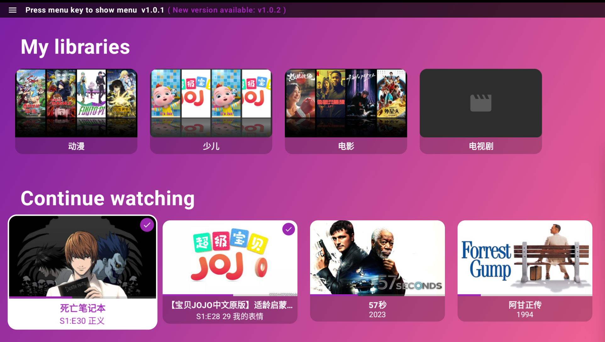
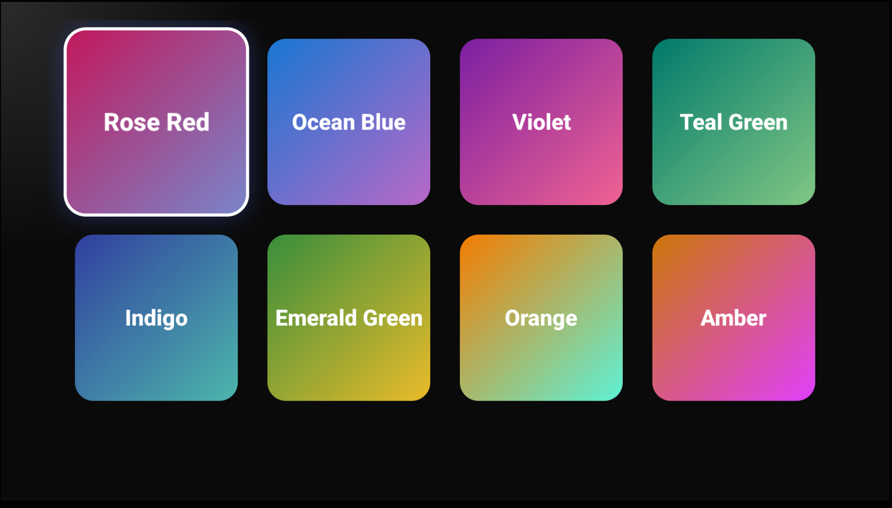

# 🎬 OpenEmby TV

<div align="center">



**开源 Emby TV 客户端 | Open-source Emby Client for TV/Box**

[](https://www.android.com)
[](https://github.com/shareven/openemby_tv/releases/)
[](https://creativecommons.org/licenses/by-nc/4.0/)
[](https://github.com/shareven/openemby_tv/releases/latest)

[简体中文](#简介--introduction) · [English](#introduction)

---

</div>

## ✨ 简介 / Introduction

> 这是一个用于学习和技术交流的开源 Emby 客户端（TV/盒子向界面）。

本项目主要用于学习 Android 在 TV/遥控交互、焦点管理、流式播放集成（Emby API）以及多语言本地化等方面的实践。

**🛡️ 隐私安全**：App 不收集任何个人信息。只主动访问了 [GitHub Releases API](https://api.github.com/repos/shareven/openemby_tv/releases/latest) 用于下载更新，其他数据接口为用户自己填的服务器地址。

> An open-source Emby client aimed at learning and exchanging technical knowledge. This project demonstrates Android usage for TV/remote UI, focus handling, streaming integration with Emby API, and localization.

**🛡️ Privacy & Security**: The app does not collect any personal information. It only accesses the GitHub releases API to download updates. All other data connections are user-configured server addresses.

---

## 📥 下载 / Download

> 最新版本 / Newest release: v2.0.20

| 最低 Android 版本 | 下载地址 |
|:------------------:|:--------:|
| Android 6.0+ | [GitHub Releases](https://github.com/shareven/openemby_tv/releases/) |

---

## ⭐ 特性 / Features

| # | 功能特性 | Feature |
|:-:|:--------|:--------|
| 🔐 | 支持扫码录入登录信息 | Scan QR code to enter login information |
| 🎨 | 支持多种主题色选择 | Multiple theme color options |
| 🔍 | 搜索功能，支持多服务器多帐号的融合搜索 | Search across multiple servers and accounts |
| 📺 | 支持硬解播放 4K HDR 视频，硬解失败时自动调用服务器转码 | Hardware decoding of 4K HDR video with auto-transcode fallback |
| ⚡️ | 服务器硬件加速时显示 ⚡️ 图标 | Lightning bolt icon ⚡️ when server-side hardware acceleration is active |
| 🌈 | 支持杜比视界硬解，显示杜比视界相关信息 | Dolby Vision hardware decoding with info display |
| 🎮 | TV/遥控器焦点与按键交互 | Focus and key handling for TV remotes |
| ▶️ | 播放器（支持直接播放与转码信息展示） | Player with direct stream/transcode info |
| 📋 | 选集与剧集导航 | Series / Episodes navigation |
| 🌐 | 简中/英文本地化（跟随系统语言） | Simplified Chinese and English localization |
| ❤️ | 首页展示收藏列表 | Favorites list on homepage |
| ⏭️ | 支持跳过片头 | Skip opening credits/intros |
| 💾 | 支持缓冲设置 | Buffer settings support |
| 🔊 | 支持更多音频本地 ffmpeg 解码 | Extended audio codec support via local ffmpeg |
| 🌐 | 支持配置 HTTP/SOCKS5 代理（仅代理 Emby 服务） | HTTP/SOCKS5 proxy support (Emby service only) |

> **支持的音频格式**: `flac`, `alac`, `pcm_mulaw`, `pcm_alaw`, `mp3`, `aac`, `ac3`, `eac3`, `dca`, `mlp`, `truehd`

---

## 📱 展示 / Screenshots

### 🏠 首页 / Home Screen


### 🎨 主题色选择 / Theme Colors


---

## 🌍 本地化 / Localization

本项目维护中/英文文本于以下文件，界面会根据系统语言自动选择对应语言：
This project maintains Chinese and English text in the following files, and the UI automatically selects the corresponding language based on system settings:

| 文件路径 / File Path | 语言 / Language |
|:--------|:----:|
| `app/src/main/res/values-zh/strings.xml` | 简体中文 / Simplified Chinese |
| `app/src/main/res/values/strings.xml` | English |

> 本项目维护中文和英文文本于对应文件中，界面会根据系统语言自动选择。若要新增翻译，请在对应文件中添加键。
> This project maintains Chinese and English text in their respective files. The UI automatically selects the language based on system settings. To add a new translation, add the key to the corresponding file.

---

## 🎯 播放流程 / Playback Flow

```
┌─────────────┐     ┌─────────────┐     ┌─────────────┐     ┌─────────────┐
│  点击播放   │ ──▶ │  调用接口    │ ──▶ │  设置播放器  │ ──▶ │  开始播放   │
│ User clicks │     │ Call API    │     │ Setup player│     │ Start       │
│    play     │     │             │     │             │     │ playback    │
└─────────────┘     └─────────────┘     └─────────────┘     └─────────────┘
```

### 1️⃣ 播放初始化 / Playback Initialization
```
用户点击播放 → 调用播放信息接口 → 设置播放器 → 开始播放
User clicks play → Call playback info API → Setup player → Start playback
```

### 2️⃣ 播放状态上报 / Playback Status Reporting
```
播放开始 → 注册会话 → 定期上报进度 → 播放结束
Playback starts → Register session → Report progress periodically → Playback ends
```

### 3️⃣ 错误处理与转码管理 / Error Handling & Transcoding

```
播放失败 ──▶ 自动转码回退 ──▶ 重试机制
Playback fails ──▶ Auto transcode fallback ──▶ Retry
```

**转码服务管理 / Transcoding Service Management:**

| 场景 / Scenario | 行为 / Behavior |
|:----|:-----|
| 轨道切换 / Track switching | 检测到转码 URL 存在则停止之前的转码任务 / Stop previous transcode task when transcode URL is detected |
| 数据加载 / Data loading | 确保没有残留的转码任务在运行 / Ensure no lingering transcode tasks |

### 4️⃣ 用户交互 / User Interaction
轨道切换、进度控制、屏幕常亮
Track switching, progress control, keep screen on

---

## 🔗 外部服务 / External Services

| 接口 / API | 用途 / Purpose |
|:----|:----|
| `GET https://api.github.com/repos/shareven/openemby_tv/releases/latest` | 获取最新版本信息 / Get latest version info |

---

## 🤝 贡献与交流 / Contributing

欢迎通过 Issues 或 PR 交流问题与改进想法！
Feel free to open Issues or PRs to discuss problems or suggest improvements!

> Please open Issues or PRs for bugs or improvements. This project is primarily for learning and technical exchange.

---

## 📜 许可 / License

<a rel="license" href="https://creativecommons.org/licenses/by-nc/4.0/"></a>

本项目使用 **禁止商业用途** 的许可：
This project is licensed under a **non-commercial** license:

**Creative Commons Attribution-NonCommercial 4.0 International (CC BY-NC 4.0)**

| 允许 / Allowed | 禁止 / Not Allowed |
|:----|:----:|
| ✅ 复制和分发 / Copy and distribute | ❌ 商业用途 / Commercial use |
| ✅ 改编和改造 / Adapt and remix | |
| ✅ 注明作者和来源 / Attribution required | |

**简要说明**：允许复制、分发和改编，但禁止用于商业用途，使用时需注明作者并链接到许可协议。
**Summary**: You are free to copy, distribute, and adapt the work, but you cannot use it for commercial purposes. You must attribute the author and include a link to the license.

> You are free to copy, distribute, and adapt the work, as long as you don't use it for commercial purposes. You must attribute the work and include a link to the license.

**许可证原文 / License Text:**
https://creativecommons.org/licenses/by-nc/4.0/legalcode

**SPDX-License-Identifier:** `CC-BY-NC-4.0`

---

<div align="center">

**如果这个项目对你有帮助，欢迎 ⭐ Star**
**If this project is helpful to you, please ⭐ Star**

*Made with ❤️ for the Emby community*

</div>
