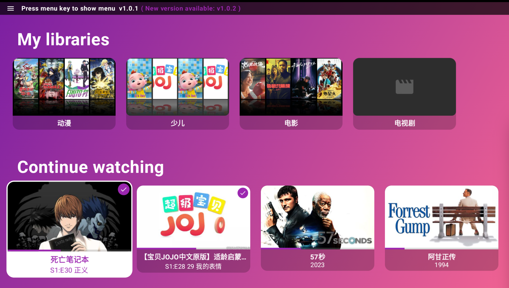
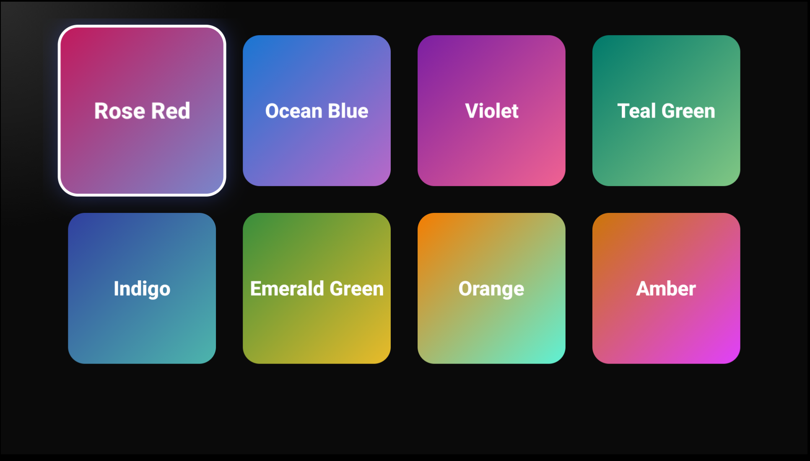

# 🎬 B0BEmby

<div align="center">



**基于 OpenEmby TV 的个人自用改造版 | Personal fork of OpenEmby TV**

[](https://www.android.com)
[](https://github.com/wangbob-0787/B0BEmby/releases/)
[](https://creativecommons.org/licenses/by-nc/4.0/)
[](https://github.com/wangbob-0787/B0BEmby/releases/latest)

[简体中文](#简介--introduction) · [English](#introduction)

---

</div>

## 📌 关于本仓库 / About This Repository

**本仓库是 [shareven/OpenEmby TV](https://github.com/shareven/openemby_tv) 的个人自用改造版，仅供本人及家庭内部使用，不作商业用途，也不对外提供任何形式的服务或技术支持。**

- **上游来源 / Upstream**：基于 [shareven/openemby_tv](https://github.com/shareven/openemby_tv)（快照版本 v2.0.20）改造，原作者为 **shareven**，本项目沿用其 **CC BY-NC 4.0** 许可。
- **用途声明 / Usage**：个人与家庭自用（自建 Emby 服务器 + 电视 / 投影设备），非面向公众分发的项目。
- **改动说明 / Changes**：见下方「本仓库的改动」。

> This repository is a **personal fork** of [shareven/OpenEmby TV](https://github.com/shareven/openemby_tv), for private home use only. **No commercial use.** All credit for the original project goes to its author **shareven**; this fork is licensed under the same **CC BY-NC 4.0** and all modifications are listed below.

### 🔧 本仓库的改动 / Changes in This Fork

| 模块 | 改动 |
|:----|:----|
| 弹幕 | 自写弹幕层：解析 ASS 字幕的 `\move` 逐帧绘制（Media3 原生不支持） |
| 详情页 | 新增详情页 |
| 主题 | 新增暗色主题 |
| 首屏 | 首屏缓存，减少冷启动等待 |
| 播放 | 只换封装，保住 4K / HDR 原画直通，避免落到服务端转码 |
| 播放页 | 按键语义、菜单层级、缓冲策略、选集焦点按遥控器实际手感重做 |
| 倍速 | 1.0 倍速以外绕开音频直通与隧道模式，改走 PCM + Sonic，修复「显示已变速但音画不动」 |
| 日志 | 埋点改走 app 内置文件日志（投影设备不提供 logcat） |
| 文档 | 新增 `SDR_HDR_GUIDE.md`（SDR / HDR 播放说明） |

> 上游的核心播放流程与 Emby API 集成逻辑未作改动。

---

## ✨ 简介 / Introduction

> 这是一个用于学习和技术交流的开源 Emby 客户端（TV/盒子向界面）。

本项目主要用于学习 Android 在 TV/遥控交互、焦点管理、流式播放集成（Emby API）以及多语言本地化等方面的实践。

**🛡️ 隐私安全**：App 不收集任何个人信息。应用内更新检查已**关闭**（本仓库为私有个人自用版，不再访问任何 GitHub 接口），除用户自己填写的服务器地址外，App 不主动访问其他外部接口。

> An open-source Emby client aimed at learning and exchanging technical knowledge. This project demonstrates Android usage for TV/remote UI, focus handling, streaming integration with Emby API, and localization.

**🛡️ Privacy & Security**: The app does not collect any personal information. In-app update checking is **disabled** in this private personal fork, so the app does not access any GitHub API. All other data connections are user-configured server addresses.

---

## 📥 下载 / Download

> 构建产物见本仓库 [Releases](https://github.com/wangbob-0787/B0BEmby/releases)，每次推送后由 GitHub Actions 云端编译生成，标签形如 `build-NN`。

| 最低 Android 版本 | 下载地址 |
|:------------------:|:--------:|
| Android 6.0+ | [本仓库 Releases](https://github.com/wangbob-0787/B0BEmby/releases) |

---

## ⭐ 特性 / Features

| # | 功能特性 | Feature |
|:-:|:--------|:--------|
| 🔐 | 支持扫码录入登录信息 | Scan QR code to enter login information |
| 🎨 | 支持多种主题色选择 | Multiple theme color options |
| 🔍 | 搜索功能，支持多服务器多帐号的融合搜索 | Search across multiple servers and accounts |
| 📺 | 支持硬解播放 4K HDR 视频，硬解失败时自动调用服务器转码 | Hardware decoding of 4K HDR video with auto-transcode fallback |
| ⚡️ | 服务器硬件加速时显示 ⚡️ 图标 | Lightning bolt icon ⚡️ when server-side hardware acceleration is active |
| 🌈 | 支持杜比视界硬解，显示杜比视界相关信息 | Dolby Vision hardware decoding with info display |
| 🎮 | TV/遥控器焦点与按键交互 | Focus and key handling for TV remotes |
| ▶️ | 播放器（支持直接播放与转码信息展示） | Player with direct stream/transcode info |
| 📋 | 选集与剧集导航 | Series / Episodes navigation |
| 🌐 | 简中/英文本地化（跟随系统语言） | Simplified Chinese and English localization |
| ❤️ | 首页展示收藏列表 | Favorites list on homepage |
| ⏭️ | 支持跳过片头 | Skip opening credits/intros |
| 💾 | 支持缓冲设置 | Buffer settings support |
| 🔊 | 支持更多音频本地 ffmpeg 解码 | Extended audio codec support via local ffmpeg |
| 🌐 | 支持配置 HTTP/SOCKS5 代理（仅代理 Emby 服务） | HTTP/SOCKS5 proxy support (Emby service only) |

> **支持的音频格式**: `flac`, `alac`, `pcm_mulaw`, `pcm_alaw`, `mp3`, `aac`, `ac3`, `eac3`, `dca`, `mlp`, `truehd`

---

## 📱 展示 / Screenshots

### 🏠 首页 / Home Screen


### 🎨 主题色选择 / Theme Colors


---

## 🌍 本地化 / Localization

本项目维护中/英文文本于以下文件，界面会根据系统语言自动选择对应语言：
This project maintains Chinese and English text in the following files, and the UI automatically selects the corresponding language based on system settings:

| 文件路径 / File Path | 语言 / Language |
|:--------|:----:|
| `app/src/main/res/values-zh/strings.xml` | 简体中文 / Simplified Chinese |
| `app/src/main/res/values/strings.xml` | English |

> 本项目维护中文和英文文本于对应文件中，界面会根据系统语言自动选择。若要新增翻译，请在对应文件中添加键。
> This project maintains Chinese and English text in their respective files. The UI automatically selects the language based on system settings. To add a new translation, add the key to the corresponding file.

---

## 🎯 播放流程 / Playback Flow

```
┌─────────────┐     ┌─────────────┐     ┌─────────────┐     ┌─────────────┐
│  点击播放   │ ──▶ │  调用接口    │ ──▶ │  设置播放器  │ ──▶ │  开始播放   │
│ User clicks │     │ Call API    │     │ Setup player│     │ Start       │
│    play     │     │             │     │             │     │ playback    │
└─────────────┘     └─────────────┘     └─────────────┘     └─────────────┘
```

### 1️⃣ 播放初始化 / Playback Initialization
```
用户点击播放 → 调用播放信息接口 → 设置播放器 → 开始播放
User clicks play → Call playback info API → Setup player → Start playback
```

### 2️⃣ 播放状态上报 / Playback Status Reporting
```
播放开始 → 注册会话 → 定期上报进度 → 播放结束
Playback starts → Register session → Report progress periodically → Playback ends
```

### 3️⃣ 错误处理与转码管理 / Error Handling & Transcoding

```
播放失败 ──▶ 自动转码回退 ──▶ 重试机制
Playback fails ──▶ Auto transcode fallback ──▶ Retry
```

**转码服务管理 / Transcoding Service Management:**

| 场景 / Scenario | 行为 / Behavior |
|:----|:-----|
| 轨道切换 / Track switching | 检测到转码 URL 存在则停止之前的转码任务 / Stop previous transcode task when transcode URL is detected |
| 数据加载 / Data loading | 确保没有残留的转码任务在运行 / Ensure no lingering transcode tasks |

### 4️⃣ 用户交互 / User Interaction
轨道切换、进度控制、屏幕常亮
Track switching, progress control, keep screen on

---

## 🔗 外部服务 / External Services

| 接口 / API | 用途 / Purpose |
|:----|:----|
| 无 / None | 应用内更新检查已关闭，App 不访问任何外部服务 / In-app update check is disabled; no external service is accessed |

---

## 🤝 贡献与交流 / Contributing

本项目为个人自用改造版，不接收 PR，问题与想法请提给上游项目 [shareven/openemby_tv](https://github.com/shareven/openemby_tv)。
This is a personal fork; pull requests are not accepted. Please report issues and suggestions to the upstream project.

---

## 📜 许可 / License

<a rel="license" href="https://creativecommons.org/licenses/by-nc/4.0/"></a>

本项目使用 **禁止商业用途** 的许可：
This project is licensed under a **non-commercial** license:

**Creative Commons Attribution-NonCommercial 4.0 International (CC BY-NC 4.0)**

| 允许 / Allowed | 禁止 / Not Allowed |
|:----|:----:|
| ✅ 复制和分发 / Copy and distribute | ❌ 商业用途 / Commercial use |
| ✅ 改编和改造 / Adapt and remix | |
| ✅ 注明作者和来源 / Attribution required | |

**简要说明**：允许复制、分发和改编，但禁止用于商业用途，使用时需注明作者并链接到许可协议。本项目为上游项目的改造版，原作者署名与许可声明一并保留。
**Summary**: You are free to copy, distribute, and adapt the work, but you cannot use it for commercial purposes. You must attribute the author and include a link to the license.

> You are free to copy, distribute, and adapt the work, as long as you don't use it for commercial purposes. You must attribute the work and include a link to the license.

**许可证原文 / License Text:**
https://creativecommons.org/licenses/by-nc/4.0/legalcode

**SPDX-License-Identifier:** `CC-BY-NC-4.0`

---

<div align="center">

**个人自用项目，仅供学习参考，不提供技术支持**
**Personal use only — no support provided**

*Based on [shareven/openemby_tv](https://github.com/shareven/openemby_tv) · CC BY-NC 4.0*

</div>
